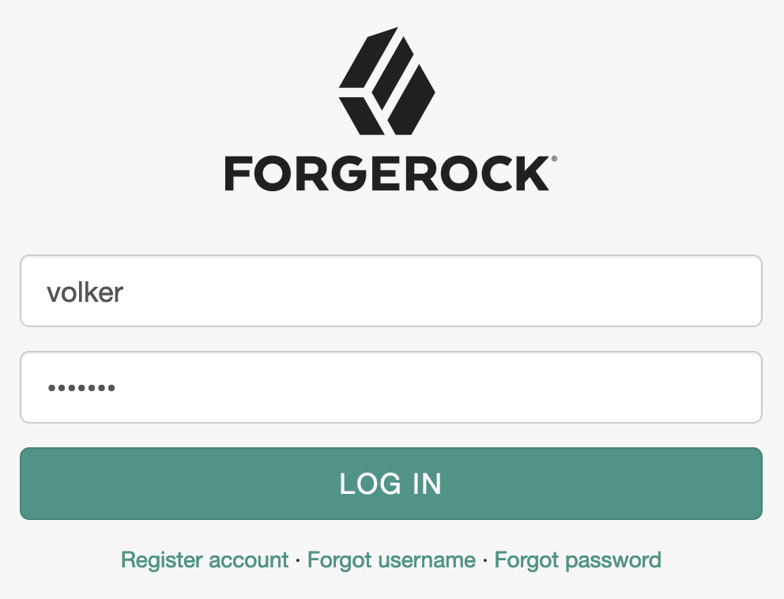

# HTML Message Node
Display an HTML-formatted message in an authentication tree and/or change the default button text.

An authentication node for ForgeRock's [Identity Platform][forgerock_platform] 6.5.2 and above. This node allows you to display a dynamic HTML-formatted message in a configurable location during an authentication or registration flow and optionally change the default *Log In* button's text.

Download a release build fom the *release* tab or clone this repository to build your own release. Copy the .jar file from your download location or the *./target* directory (if you built it yourself) into the *../web-container/webapps/openam/WEB-INF/lib* directory where AM is deployed.  Restart the web container to pick up the new node.  The node will then appear in the authentication trees components palette.

## Related Nodes
- <a href="https://github.com/vscheuber/TermsAndConditionsNode">Terms And Conditions Node</a>
- <a href="https://github.com/vscheuber/ProgressiveProfileCompletion">Progressive Profile Completion Node</a>

## Usage
Use this node to esily add custom links below the login button like: 
<a href="https://am.mytestrun.com/openam/?service=register">Register account</a> · <a href="https://am.mytestrun.com/user/#/forgotusername">Forgot username</a> · <a href="https://am.mytestrun.com/user/#/passwordreset">Forgot password</a>
 Or display personalized messages such as "Hello {{username}}" using shared state variable names, which will be substituted with their value at runtime.

A sample tree could look like this:

Note: The user is first properly authenticated using username and password, only then does she reach the PPC node.

A few sample dialogs:

Footer with links | Message with custom button text | Personalized greeting
----------------- | ------------------------------- | ---------------------
 |  | 

## Settings
Setting             | Description
------------------- | -----------
Message | Enter the message to display. Use HTML tags for formatting. You can reference shared state variable anywhere in your message using the <code>{{variable}}</code> notation.
Vertically Align | Select where you would like the message to appear vertically: Top inserts it before the first field, bottom inserts it at the very end (after the button), and neutral inserts it right where you position the node (top and neutral only differ inside a page node).
Horizontally Align | Select the text alignment inside the box.
Box | Select this option to have the message appear in a box.
Overwrite Button | Enable this option to change the text of the <code>LOG IN</code> button.
Button Text | Specify localized texts for to overwrite the <code>LOG IN</code> button with.

## Building Authentication Nodes
The code in this repository has binary dependencies that live in the ForgeRock maven repository. Maven can be configured to authenticate to this repository by following the following [ForgeRock Knowledge Base Article](https://backstage.forgerock.com/knowledge/kb/article/a74096897).

The code described herein is provided on an "as is" basis, without warranty of any kind, to the fullest extent permitted by law. ForgeRock does not warrant or guarantee the individual success developers may have in implementing the sample code on their development platforms or in production configurations.

ForgeRock does not warrant, guarantee or make any representations regarding the use, results of use, accuracy, timeliness or completeness of any data or information relating to the sample code. ForgeRock disclaims all warranties, expressed or implied, and in particular, disclaims all warranties of merchantability, and warranties related to the code, or any service or software related thereto.

ForgeRock shall not be liable for any direct, indirect or consequential damages or costs of any type arising out of any action taken by you or others related to the sample code.

[forgerock_platform]: https://www.forgerock.com/platform/